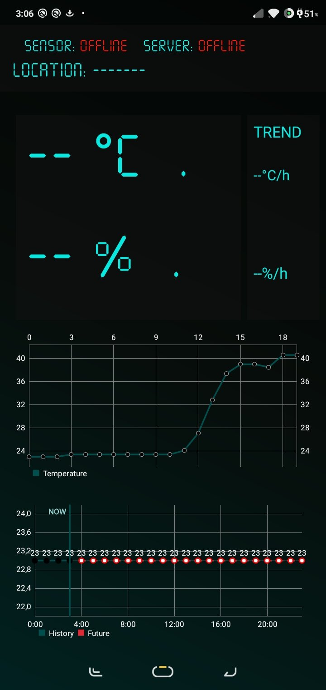
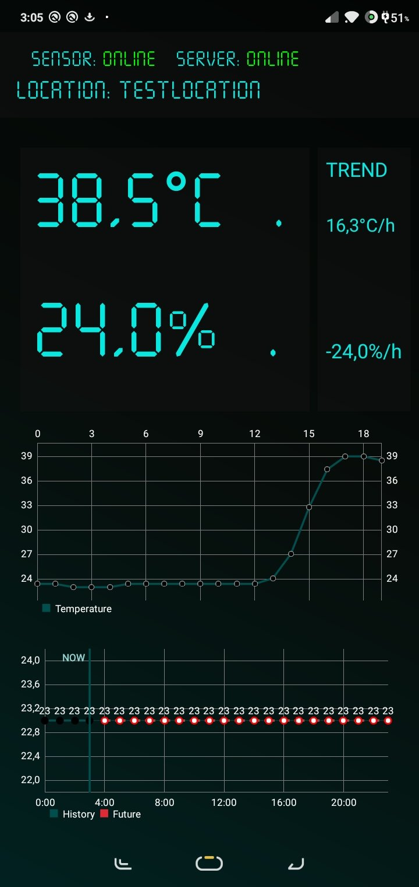
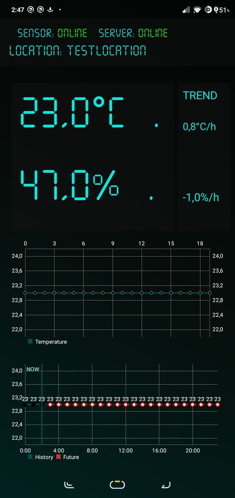

README.md
# IoT Monitor App

Aplikacja Android do monitorowania danych z urządzeń IoT w czasie rzeczywistym.  
Aplikacja wyświetla temperaturę oraz wilgotność pobieraną z backendowego API i prezentuje dane na żywo przy użyciu wykresów.

## Funkcje

- Monitorowanie temperatury w czasie rzeczywistym
- Monitorowanie wilgotności w czasie rzeczywistym
- Automatyczne odświeżanie co 10 sekund
- Wykrywanie statusu urządzenia (ONLINE/OFFLINE)
- Wykres historii temperatury
- Wizualizacja temperatury z ostatnich 24 godzin
- Integracja z REST API przy użyciu Retrofit
- Obsługa wykresów MPAndroidChart
- Interfejs w stylu retro terminal

---

# Zrzuty ekranu

<p align="center">
  
  
  
</p>

```text
/app/screenshots/
Wykorzystane technologie
Kotlin
Android SDK
Retrofit2
Gson
MPAndroidChart
Struktura projektu
app/
├── java/pl/rjwaliczek/iot_app/
│   ├── MainActivity.kt
│   ├── RetrofitClient.kt
│   ├── ApiService.kt
│   ├── Measurement.kt
│
├── res/
│   ├── layout/
│   ├── drawable/
│   ├── values/
Endpointy API

Aplikacja komunikuje się z backendowym REST API.

Dostępne endpointy
Endpoint	Opis
/api/v1/measurements/latest	Ostatnie pomiary
/api/v1/measurements/current	Aktualny pomiar
/api/v1/measurements/last-hour	Dane z ostatniej godziny
/api/v1/measurements/all	Pełna historia pomiarów
Model danych
data class Measurement (
    val id: Long,
    val ts: String,
    val temperature: Double,
    val humidity: Double,
    val device: String,
    val location: String
)
Instalacja
1. Sklonuj repozytorium
git clone https://github.com/twoj-login/iot-monitor-app.git
2. Otwórz projekt

Uruchom projekt w:

Android Studio
3. Skonfiguruj adres backendu

Edytuj plik:

RetrofitClient.kt

Zmień:

private const val BASE_URL = "http://10.42.0.1:8080"

Przykład dla sieci lokalnej:

private const val BASE_URL = "http://192.168.1.100:8080"
4. Uruchom serwer backend

Upewnij się, że REST API działa i jest dostępne z poziomu telefonu lub emulatora Androida.

5. Uruchom aplikację

Podłącz:

telefon z Androidem
lub
emulator Android

Następnie kliknij:

Run ▶

w Android Studio.

Zależności

Dodaj do:

build.gradle
Retrofit
implementation 'com.squareup.retrofit2:retrofit:2.11.0'
implementation 'com.squareup.retrofit2:converter-gson:2.11.0'
MPAndroidChart
implementation 'com.github.PhilJay:MPAndroidChart:v3.1.0'
Wykresy

Aplikacja zawiera dwa wykresy:

Live Chart
Ostatnie pomiary temperatury
Automatyczne odświeżanie
Motyw kolorystyczny cyan
Wykres 24h
Dane historyczne
Wizualizacja przyszłych wartości
Znacznik aktualnej godziny („NOW”)
Wykrywanie statusu urządzenia

Aplikacja sprawdza timestamp ostatniego pomiaru:

<= 30 sekund → ONLINE

30 sekund → OFFLINE

Interwał odświeżania
private val refreshInterval: Long = 10000

Domyślnie:

10000 ms
10 sekund
Możliwe przyszłe funkcje
Obsługa MQTT
Powiadomienia
Tryb jasny/ciemny
Statystyki czujników
Eksport danych do CSV
Obsługa wielu urządzeń
System logowania
Licencja

MIT License

Autor

Rafał Waliczek